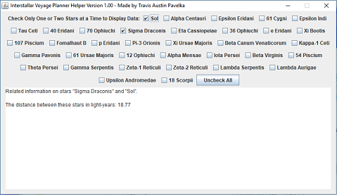

# InterstellarVoyage

Want to plan a trip through the stars? The Interstellar Voyage Planner can help you!

This program was created for a math class when I was a freshman in college. It was
an online course, and the final project involved a lot of redundant math. I decided
to make this program in order to ensure a good grade on the project. I ended up
making a 100 on that project.

I created this project having known Java for at least a year and a half, so 2013-ish.

## Screenshots:

